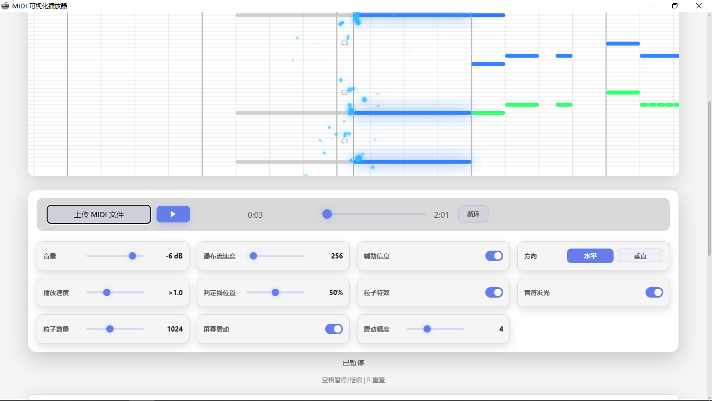
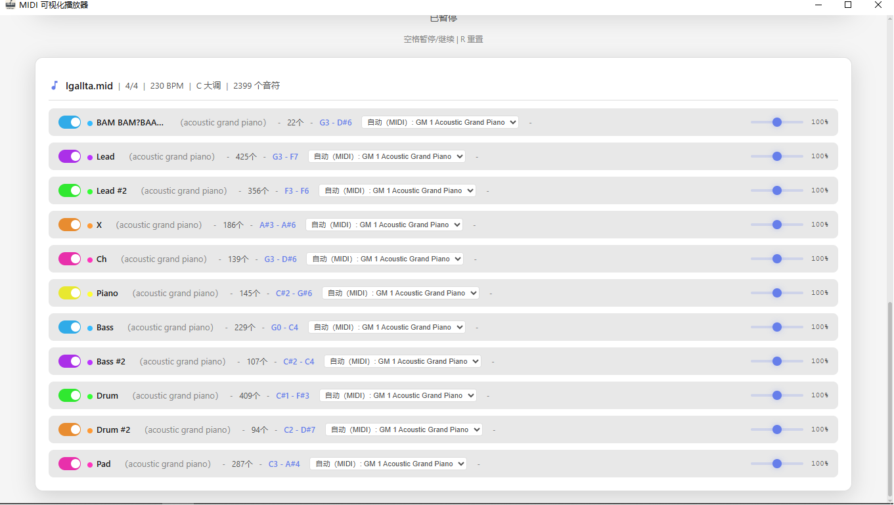
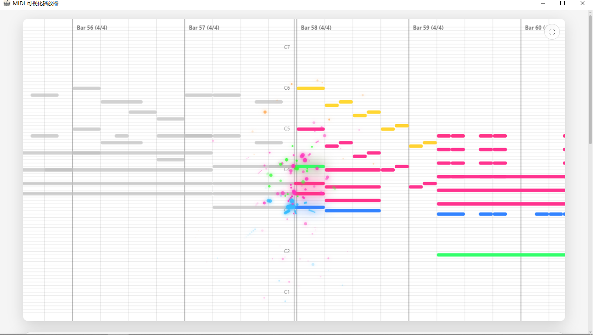
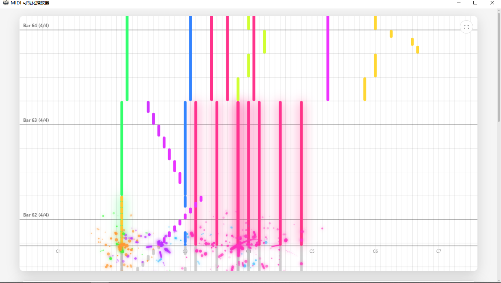

# MIDI 可视化播放器

一个基于 Python + Flask + pywebview 的 MIDI 音频可视化播放器，支持瀑布流动画、粒子特效、多种音色库。

---

## 预览

| 主界面 | 音轨 |
|:---:|:---:|
|  |  |

| 水平模式 | 垂直模式 |
|:---:|:---:|
|  |  |

### 演示视频

<video src="./screenshots/video.mp4" controls width="100%" style="max-width: 720px; border-radius: 12px;"></video>
---

## 功能特性

- **MIDI 播放** — 支持 `.mid` / `.midi` 文件
- **瀑布流可视化** — 支持水平/垂直两种方向
- **粒子特效** — 音符碰撞时产生粒子效果
- **音符发光** — 自定义发光效果开关
- **可调速度** — 瀑布流滚动速度实时调整
- **独立音量** — 每个音轨独立控制音量/静音
- **循环播放** — 支持单曲循环
- **GM 音色库** — 内置 FluidR3_GM 等音色库
- **全屏模式** — 支持原生窗口全屏（隐藏鼠标）


## 使用方法

### 直接运行（Python）
```bash
cd "MIDI Player"
.venv\Scripts\pythonw.exe "MIDI Player.py"
```

### 打包为 exe
```bash
bluid.bat
```
生成的可执行文件在 `dist/MIDI Player.exe`

### 已打包版本
前往[Releases](https://github.com/0anmuxi0/MIDI-Player/releases)页面下载构建好的版本

---

## 技术栈

- **后端**: Python, Flask, pywebview
- **前端**: HTML5 Canvas, Tone.js, JavaScript
- **音色库**: FluidR3_GM, FatBoy, Salamander
- **打包**: PyInstaller